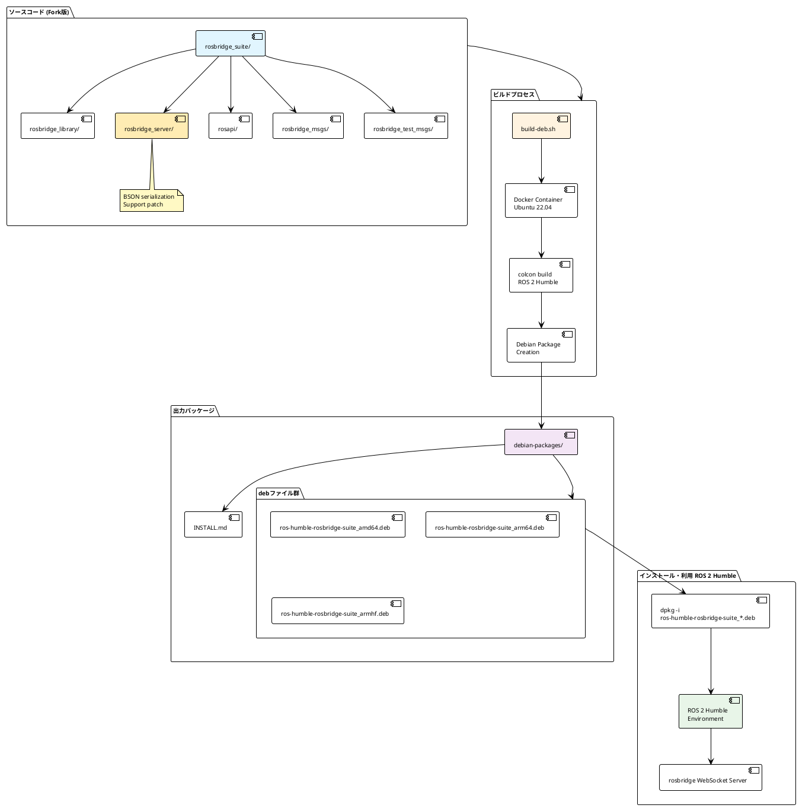

# ROS 2 Humble rosbridge_suite Debian パッケージビルド

このドキュメントは、BSON対応を追加したrosbridge_suiteの単一Debianパッケージをビルドする方法を説明します。

## プロジェクトについて

- 本家の[rosbridge_suite](https://github.com/RobotWebTools/rosbridge_suite)からforkしたプロジェクトです
- **ROS 2 Humble専用**のパッケージです（他のROSディストリビューションはサポートされていません）
- rosbridge_serverにBSONシリアライゼーションサポートを追加したカスタム版です

## 概要

Dockerを使用してクリーンな環境でDebianパッケージをビルドし、`apt install`でインストール可能な単一パッケージを生成します。

## 必要な環境

- Docker
- Ubuntu 22.04 (パッケージのインストール先)
- **ROS 2 Humble** (パッケージのインストール先) - **必須**

⚠️ **注意**: このパッケージはROS 2 Humble専用です。他のROSディストリビューション（Foxy、Galactic、Iron等）では動作しません。

## ビルド方法

### 1. ビルドの実行

```bash
# リポジトリのルートディレクトリで実行
./build-deb.sh
```

このスクリプトは以下を実行します：
1. Debian パッケージビルド用のDockerイメージを作成
2. colconでrosbridge_suite全体をビルド
3. 単一のDebianパッケージを作成
4. 成果物を`debian-packages/`ディレクトリに出力

### 2. ビルド成果物

ビルドが成功すると、以下のファイルが`debian-packages/`ディレクトリに生成されます：

- `ros-humble-rosbridge-suite_<arch>.deb` - 統合パッケージ（amd64, arm64, armhfなど）
- `INSTALL.md` - インストール手順

## インストール方法

### パッケージのインストール

```bash
cd debian-packages
sudo apt install ./ros-humble-rosbridge-suite_*.deb
```

これで、BSON対応を含むrosbridge_suite全体がインストールされます。

## 動作確認

```bash
# ROS 2環境の準備
source /opt/ros/humble/setup.bash

# インストールの確認
ros2 pkg list | grep rosbridge

# 出力例:
# rosbridge_library
# rosbridge_msgs
# rosbridge_server
# rosbridge_suite
# rosbridge_test_msgs

# WebSocketサーバーの起動
ros2 launch rosbridge_server rosbridge_websocket_launch.xml
```

WebSocketサーバーは`ws://localhost:9090`でBSON対応を含めて利用可能になります。

### 正常起動時の出力例

```
[INFO] [rosbridge_websocket-1]: process started with pid [24]
[INFO] [rosapi_node-2]: process started with pid [26]
[INFO] [rosbridge_websocket]: Rosbridge WebSocket server started on port 9090
```

## トラブルシューティング

### ビルドエラーの場合

1. Dockerが正しくインストールされているか確認
   ```bash
   docker --version
   ```

2. ビルドログを確認
   ```bash
   # Dockerコンテナ内でインタラクティブに実行
   docker run -it --rm \
     -v "$(pwd):/source:ro" \
     -v "$(pwd)/debian-packages:/output" \
     rosbridge-debian-builder:latest \
     /bin/bash
   ```

### インストールエラーの場合

1. 依存関係の確認
   ```bash
   sudo apt update
   sudo apt install -f
   ```

2. ROS 2 Humbleが正しくインストールされているか確認
   ```bash
   source /opt/ros/humble/setup.bash
   ros2 --version
   ```

### よくある問題と解決策

#### 1. `ros2 launch`でパッケージが見つからない

**問題**:
```
[ERROR] [launch]: package 'rosbridge_server' not found
```

**解決策**:
```bash
# ROS 2環境が正しくセットアップされているか確認
source /opt/ros/humble/setup.bash

# パッケージが認識されているか確認
ros2 pkg list | grep rosbridge
```

#### 2. 共有ライブラリエラー

**問題**:
```
ImportError: librosbridge_msgs__rosidl_generator_py.so: cannot open shared object file
```

**解決策**: パッケージを再インストールしてください：
```bash
sudo dpkg -r ros-humble-rosbridge-suite
sudo dpkg -i ros-humble-rosbridge-suite_*.deb
```

#### 3. WebSocketサーバーが起動しない

**問題**: プロセスが起動後すぐに終了する

**解決策**:
```bash
# 詳細ログを確認
ros2 launch rosbridge_server rosbridge_websocket_launch.xml --ros-args --log-level DEBUG

# 必要な依存関係がインストールされているか確認
sudo apt install python3-twisted python3-tornado python3-autobahn python3-pymongo python3-pil
```

## カスタマイズ

### 個別パッケージビルド

Dockerファイルは`docker/`ディレクトリに整理されています：

- `docker/Dockerfile.debian-build` - ビルド環境用Dockerfile
- `docker/build-single-deb.sh` - パッケージビルドスクリプト

手動でDockerを使用する場合：

```bash
docker build -f docker/Dockerfile.debian-build -t rosbridge-debian-builder .
docker run --rm -v "$(pwd):/source:ro" -v "$(pwd)/debian-packages:/output" rosbridge-debian-builder
```

### 全アーキテクチャ用ビルド

主要なアーキテクチャ（amd64、arm64、armhf）用のパッケージを一括ビルド：

```bash
# 注意: QEMUエミュレーションが必要（時間がかかります）
./build-all-arch.sh
```

※ QEMUエミュレーションを使用するため、ネイティブビルドより時間がかかります

## システムアーキテクチャー



## dpkg コマンドの使用方法

### 基本的なdpkgコマンド

```bash
# パッケージのインストール
sudo dpkg -i ros-humble-rosbridge-suite_*.deb

# パッケージの削除
sudo dpkg -r ros-humble-rosbridge-suite

# パッケージの完全削除（設定ファイルも削除）
sudo dpkg -P ros-humble-rosbridge-suite

# インストール済みパッケージの確認
dpkg -l | grep rosbridge

# パッケージの詳細情報表示
dpkg -s ros-humble-rosbridge-suite

# パッケージの内容確認
dpkg -L ros-humble-rosbridge-suite

# パッケージファイルの内容確認（インストール前）
dpkg -c ros-humble-rosbridge-suite_*.deb
```

### 依存関係の解決

```bash
# 依存関係エラーの修正
sudo apt install -f

# 依存関係の確認
dpkg -I ros-humble-rosbridge-suite_*.deb

# 強制インストール（依存関係を無視）
sudo dpkg -i --force-depends ros-humble-rosbridge-suite_*.deb
```

### トラブルシューティング

```bash
# パッケージの状態確認
dpkg --audit

# 破損したパッケージの修復
sudo dpkg --configure -a

# パッケージデータベースの再構築
sudo dpkg --configure --pending
```

## 技術的な詳細

### パッケージ構成

このDebianパッケージには以下のコンポーネントが含まれています：

- **rosbridge_library**: 核となるBSON対応WebSocketライブラリ
- **rosbridge_server**: BSON対応WebSocketサーバー
- **rosapi**: ROS APIサービス
- **rosbridge_msgs**: rosbridgeメッセージ定義
- **rosapi_msgs**: rosapi メッセージ定義
- **rosbridge_test_msgs**: テスト用メッセージ定義

### インストール構造

パッケージは以下の場所にインストールされます：

```
/opt/ros/humble/
├── lib/
│   ├── python3.10/site-packages/  # Pythonパッケージ
│   ├── rosbridge_server/          # 実行ファイル
│   ├── rosapi/                    # 実行ファイル
│   └── *.so                       # 共有ライブラリ
├── share/
│   ├── rosbridge_server/          # 設定・起動ファイル
│   ├── rosapi/                    # 設定・起動ファイル
│   └── ament_index/               # ROS 2パッケージ発見用インデックス
```

### BSON対応の詳細

BSON対応は`rosbridge_server/src/rosbridge_server/websocket_handler.py`に実装されています：

- **bson_only_mode**: BSON専用モードのサポート
- **バイナリデータ処理**: 効率的なバイナリメッセージ処理
- **後方互換性**: 既存のJSON APIとの互換性を維持

### パッケージサイズ

- **最終パッケージサイズ**: 約754KB
- **主要コンポーネント**:
  - Pythonライブラリ: ~400KB
  - 共有ライブラリ(.so): ~250KB
  - 設定・メタデータ: ~100KB

## 変更履歴

### v2.0.1 (最新)
- ✅ BSON serialization サポート追加
- ✅ ROS 2 Humble対応
- ✅ 標準的なROS 2パッケージ構造
- ✅ 完全なパッケージ発見機能
- ✅ 共有ライブラリ統合

## 注意事項

- このビルド方法は、公式のROS 2リポジトリへのリリースとは異なります
- ローカルまたはプライベートリポジトリでの使用を想定しています
- 公式リリースには、bloom-releaseとros/rosdistroへのPRが必要です
- **重要**: このパッケージは公式rosbridge_suiteと置き換えて使用してください
