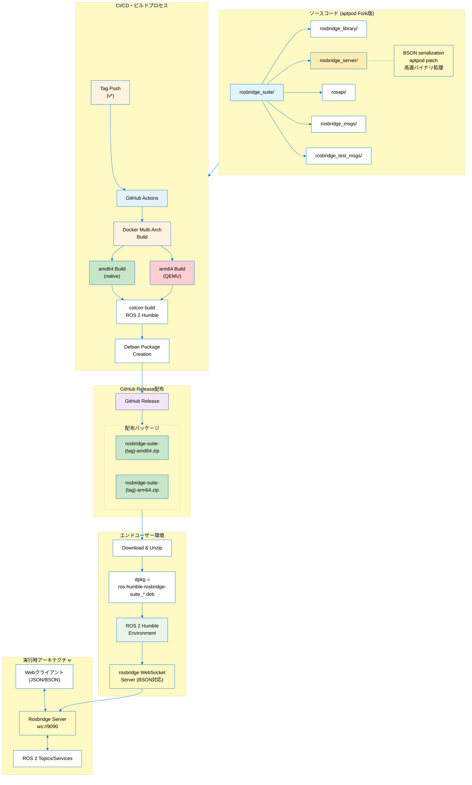

# ROS 2 Humble rosbridge_suite - Developer Guide

このドキュメントは、開発者向けのローカルビルド手順とCI/CD技術詳細を説明します。

> **📖 注意**: 事前ビルド済みパッケージをお探しの場合は、[FORK_README.md](FORK_README.md)をご覧ください。

## 目的

- 開発・デバッグ用のローカルビルド環境構築
- CI/CDシステムの理解と改良
- カスタムパッチの適用と検証
- マルチアーキテクチャビルドの技術詳細


## 必要な環境

- Docker
- Ubuntu 22.04 (パッケージのインストール先)
- **ROS 2 Humble** (パッケージのインストール先) - **必須**

⚠️ **注意**: このパッケージはROS 2 Humble専用です。他のROSディストリビューション（Foxy、Galactic、Iron等）では動作しません。

## ビルド方法

### 1. ビルドの実行

```bash
# リポジトリのルートディレクトリで実行

# 現在のアーキテクチャのみビルド（最も高速）
./build-deb.sh

# 全アーキテクチャビルド
./build-deb.sh --all

# 特定のアーキテクチャのみ
./build-deb.sh amd64

# 複数アーキテクチャ
./build-deb.sh amd64 arm64

# クリーンビルド
./build-deb.sh --clean --all
```

このスクリプトは以下を実行します：
1. Debian パッケージビルド用のDockerイメージを作成
2. colconでrosbridge_suite全体をビルド
3. 単一のDebianパッケージを作成
4. 成果物を`debian-packages/`ディレクトリに出力

### 2. ビルド成果物

ビルドが成功すると、以下のファイルが`debian-packages/`ディレクトリに生成されます：

- `ros-humble-rosbridge-suite_<arch>.deb` - 統合パッケージ（amd64, arm64）
- `INSTALL.md` - インストール手順

## インストール方法

### パッケージのインストール

```bash
cd debian-packages
sudo apt install -y ./ros-humble-rosbridge-suite_*.deb
```

これで、BSON対応を含むrosbridge_suite全体がインストールされます。

> **💡 動作確認**: インストール後の動作確認方法については、[FORK_README.md](FORK_README.md)の「サーバー起動」セクションをご覧ください。

## トラブルシューティング

### ビルドエラーの場合

1. Dockerが正しくインストールされているか確認
   ```bash
   docker --version
   ```

2. ビルドログを確認
   ```bash
   # Dockerコンテナ内でインタラクティブに実行
   docker run -it --rm \
     -v "$(pwd):/source:ro" \
     -v "$(pwd)/debian-packages:/output" \
     rosbridge-debian-builder:latest \
     /bin/bash
   ```

### インストールエラーの場合

1. 依存関係の確認
   ```bash
   sudo apt update
   sudo apt install -f
   ```

2. ROS 2 Humbleが正しくインストールされているか確認
   ```bash
   source /opt/ros/humble/setup.bash
   ros2 --version
   ```

### よくある問題と解決策

#### 1. `ros2 launch`でパッケージが見つからない

**問題**:
```
[ERROR] [launch]: package 'rosbridge_server' not found
```

**解決策**:
```bash
# ROS 2環境が正しくセットアップされているか確認
source /opt/ros/humble/setup.bash

# パッケージが認識されているか確認
ros2 pkg list | grep rosbridge
```

#### 2. 共有ライブラリエラー

**問題**:
```
ImportError: librosbridge_msgs__rosidl_generator_py.so: cannot open shared object file
```

**解決策**: パッケージを再インストールしてください：
```bash
sudo dpkg -r ros-humble-rosbridge-suite
sudo dpkg -i ros-humble-rosbridge-suite_*.deb
```

#### 3. WebSocketサーバーが起動しない

**問題**: プロセスが起動後すぐに終了する

**解決策**:
```bash
# 詳細ログを確認
ros2 launch rosbridge_server rosbridge_websocket_launch.xml --ros-args --log-level DEBUG

# 必要な依存関係がインストールされているか確認
sudo apt install python3-twisted python3-tornado python3-autobahn python3-pymongo python3-pil
```

#### 4. GitHub Actions CI/CD関連

**問題**: lint job失敗
```
end-of-file-fixer Failed
trailing-whitespace Failed
```

**解決策**:
```bash
# ローカルでlint修正
pre-commit run --all-files

# 修正をコミット・プッシュ
git add -A
git commit -m "fix: Apply pre-commit formatting fixes"
git push
```

**問題**: Build packages失敗（sed syntax error）
```
sed: can't read TAG_PLACEHOLDER: No such file or directory
```

**解決策**:
- コミットハッシュ/タグ参照の動的置換が正常動作
- RELEASE_TEMPLATE.mdの`TAG_PLACEHOLDER`が適切に置換される

#### 5. ROS 2テスト関連

**問題**: ros-tooling/action-ros-ci失敗
**解決策**: ROS 1形式の`.test`ファイルが混在していないか確認
```bash
# 不要な.testファイルを削除（ROS 2はpytestを使用）
find . -name "*.test" -type f
```

## カスタマイズ

### 個別パッケージビルド

Dockerファイルは`docker/`ディレクトリに整理されています：

- `docker/Dockerfile.debian-build` - ビルド環境用Dockerfile
- `docker/build-single-deb.sh` - パッケージビルドスクリプト

手動でDockerを使用する場合：

```bash
docker build -f docker/Dockerfile.debian-build -t rosbridge-debian-builder .
docker run --rm -v "$(pwd):/source:ro" -v "$(pwd)/debian-packages:/output" rosbridge-debian-builder
```

### 全アーキテクチャ用ビルド

amd64、arm64用のパッケージを一括ビルド：

```bash
# 注意: QEMUエミュレーションが必要（時間がかかります）
./build-deb.sh --all
```

※ QEMUエミュレーションを使用するため、ネイティブビルドより時間がかかります

### 新しい機能

```bash
# アーキテクチャ一覧の表示
./build-deb.sh --list

# ビルド前のクリーンアップ
./build-deb.sh --clean --all

# 短縮形
./build-deb.sh -a    # --all と同じ

# ヘルプ表示
./build-deb.sh --help
```

### 実用的な使用例

```bash
# 開発時：現在のアーキテクチャのみ（最も高速）
./build-deb.sh

# CI/CD：全アーキテクチャビルド
./build-deb.sh --all

# リリース準備：クリーンビルド
./build-deb.sh --clean --all

# 特定環境向け：複数アーキテクチャ
./build-deb.sh amd64 arm64

# トラブルシューティング：重複排除テスト
./build-deb.sh amd64 amd64 arm64  # 自動的に amd64 arm64 になる

# 現在の環境確認
./build-deb.sh --list
```

## GitHub Release の自動作成

### 概要

このプロジェクトでは、タグをpushすることで自動的にGitHub Releaseが作成され、アーキテクチャ別のzipファイルが配布されます。

### 使用方法

```bash
# タグを作成してpush（例：ベータ版）
git tag humble-2.0.1+aptpod0.0.1-beta.1
git push origin humble-2.0.1+aptpod0.0.1-beta.1

# タグを作成してpush（例：正式版）
git tag humble-2.0.1+aptpod0.0.1
git push origin humble-2.0.1+aptpod0.0.1
```

### 自動生成される配布物

GitHub Actionsにより、以下の成果物が自動生成されます：

- **Debian packages**: アーキテクチャ別の.debファイル
- **GitHub Release**: リリースページとzipファイル（詳細は[FORK_README.md](FORK_README.md)参照）
- **Build artifacts**: CI/CDでの中間成果物（1日保持）

### zipファイルの構成

各zipファイル（`rosbridge-suite-{tag}-{arch}.zip`）には以下が含まれます：
- `ros-humble-rosbridge-suite_{arch}.deb` - Debianパッケージ
- `INSTALL.md` - インストール手順

### ビルド時間

- **amd64**: 約5-10分
- **arm64**: 約30-60分（QEMUエミュレーション使用）

### 配布

**エンドユーザー向け**: [FORK_README.md](FORK_README.md)の「📦 インストール・使用方法」セクションをご覧ください。GitHub Releasesから事前ビルド済みパッケージが入手できます。

**開発者向け**: GitHub Actionsの"Build Debian Packages"のArtifactsからダウンロード可能です。プルリクエストやブランチのビルド結果を直接取得できます。

### 対応タグパターン

- **全てのタグ**: 任意のタグ名でReleaseが作成されます
- **推奨パターン**: `humble-<version>+aptpod<version>[-prerelease]`
  - 例: `humble-2.0.1+aptpod0.0.1`
  - 例: `humble-2.0.1+aptpod0.0.1-beta.1`

### GitHub Actions ワークフロー

GitHub Actionsは以下の条件で実行されます：

| トリガー | artifact保存期間 | Release作成 |
|----------|-----------------|-------------|
| **ブランチpush** | 1日 | なし |
| **Pull Request** | 1日 | なし |
| **タグpush** | 1日 | **あり** |

## システムアーキテクチャー



### 配布パッケージの命名例

実際のリリースでは以下のような名前でzipファイルが配布されます：
- `rosbridge-suite-humble-2.0.1+aptpod0.0.1-amd64.zip`
- `rosbridge-suite-humble-2.0.1+aptpod0.0.1-arm64.zip`

## dpkg コマンドの使用方法

### 基本的なdpkgコマンド

```bash
# パッケージのインストール
sudo apt install -y ./ros-humble-rosbridge-suite_*.deb

# パッケージの削除
sudo dpkg -r ros-humble-rosbridge-suite

# パッケージの完全削除（設定ファイルも削除）
sudo dpkg -P ros-humble-rosbridge-suite

# インストール済みパッケージの確認
dpkg -l | grep rosbridge

# パッケージの詳細情報表示
dpkg -s ros-humble-rosbridge-suite

# パッケージの内容確認
dpkg -L ros-humble-rosbridge-suite

# パッケージファイルの内容確認（インストール前）
dpkg -c ros-humble-rosbridge-suite_*.deb
```

### 依存関係の解決

```bash
# 依存関係エラーが発生した場合
# 警告: apt install -f は使用しないでください（本家版に置き換わる可能性があります）
# 代わりに、不足している依存パッケージを個別にインストールしてください
sudo apt update
sudo apt install python3-twisted python3-tornado python3-autobahn python3-pymongo python3-pil

# 依存関係の確認
dpkg -I ros-humble-rosbridge-suite_*.deb

# 強制インストール（依存関係を無視）
sudo dpkg -i --force-depends ros-humble-rosbridge-suite_*.deb
```

### トラブルシューティング

```bash
# パッケージの状態確認
dpkg --audit

# 破損したパッケージの修復
sudo dpkg --configure -a

# パッケージデータベースの再構築
sudo dpkg --configure --pending
```

## 技術的な詳細

### パッケージ構成

このDebianパッケージには以下のコンポーネントが含まれています：

- **rosbridge_library**: 核となるBSON対応WebSocketライブラリ
- **rosbridge_server**: BSON対応WebSocketサーバー
- **rosapi**: ROS APIサービス
- **rosbridge_msgs**: rosbridgeメッセージ定義
- **rosapi_msgs**: rosapi メッセージ定義
- **rosbridge_test_msgs**: テスト用メッセージ定義

### インストール構造

パッケージは以下の場所にインストールされます：

```
/opt/ros/humble/
├── lib/
│   ├── python3.10/site-packages/  # Pythonパッケージ
│   ├── rosbridge_server/          # 実行ファイル
│   ├── rosapi/                    # 実行ファイル
│   └── *.so                       # 共有ライブラリ
├── share/
│   ├── rosbridge_server/          # 設定・起動ファイル
│   ├── rosapi/                    # 設定・起動ファイル
│   └── ament_index/               # ROS 2パッケージ発見用インデックス
```

### BSON対応の詳細

BSON対応は`rosbridge_server/src/rosbridge_server/websocket_handler.py`に実装されています：

- **bson_only_mode**: 排他的モード選択（JSON専用 vs BSON専用）
- **バイナリデータ処理**: 効率的なバイナリメッセージ処理
- **公式準拠**: 公式rosbridge_suiteと一致した排他的モード設計

### パッケージサイズ

- **最終パッケージサイズ**: 約754KB
- **主要コンポーネント**:
  - Pythonライブラリ: ~400KB
  - 共有ライブラリ(.so): ~250KB
  - 設定・メタデータ: ~100KB

## 性能解析・デバッグ

### BSON効率化の詳細
現在実装されているBSON最適化：

#### 1. メッセージ変換高速化
- **Before**: `str(msg_inst)`による全データシリアライズ（250ms）
- **After**: 直接型属性アクセス（0.05ms）
- **改善率**: 約5000倍高速化

#### 2. Binary効率化
- **Before**: Base64エンコーディング（33%オーバーヘッド）
- **After**: BSON Binaryオブジェクト（バイナリ直接処理）
- **効果**: 約20%データサイズ削減

#### 3. 文字列変換最適化
- **Before**: `len(str(result))`による12MB文字列変換（80-110ms）
- **After**: 概算サイズ計算（1-2ms）
- **改善率**: 50-100倍高速化

### デバッグ情報の活用
verbose debug modeによる詳細ログ（開発時のみ）：

```bash
# デバッグログ有効化
ros2 launch rosbridge_server rosbridge_websocket_launch.xml verbose_debug_mode:=true

# ログカテゴリ
[BSON_DEBUG]: BSON効率化詳細
[ROSBRIDGE LATENCY]: レスポンス遅延分析
[WEBSOCKET_DEBUG]: WebSocket送信詳細
```

## 統合テスト

### 概要

このプロジェクトには、JSON/BSONモード両方の動作を検証するPythonベースの統合テストが含まれています。

### テストの実行

```bash
# テストディレクトリに移動
cd test/integration-test

# Dockerを使用してテスト実行
docker compose up --build --abort-on-container-exit test-client

# 手動でのテスト実行
./run-tests.sh
```

### テスト環境構成

Docker Composeを使用して以下のサービスを起動：

1. **ros-master**: ROS 2 Humble基盤環境
2. **chatter-talker**: std_msgs/String（"Hello World: X"）を送信
3. **pointcloud2-publisher**: sensor_msgs/PointCloud2（100点）を送信
4. **rosbridge-server**: BSON対応WebSocketサーバー
5. **test-client**: Python統合テストクライアント

### テスト内容

#### JSON Mode Test (`test_json.py`)
- WebSocket接続とトピック購読
- Chatterメッセージ検証（"Hello World"パターン）
- PointCloud2メッセージ検証（構造チェック）
- サービス呼び出しテスト
- 自動成功/失敗判定

#### BSON Mode Test (`test_bson.py`)
- BSONバイナリメッセージ送受信
- 同様のメッセージ検証
- データサイズ計測
- BSON専用機能テスト

#### 統合テスト (`test_all.py`)
- JSON/BSON両モードの連続実行
- 結果の統合とレポート生成
- 成功率の計算と詳細ログ

### テスト結果

テスト実行後、`results/`ディレクトリに以下が生成されます：

```
results/
├── test-results-json-{timestamp}.json    # JSON mode結果
├── test-results-bson-{timestamp}.json    # BSON mode結果
└── test-summary.json                     # 統合結果
```

### CI/CD統合

GitHub Actions (`ci.yml`) で自動実行：

```yaml
integration-test:
  name: Integration Tests
  runs-on: ubuntu-latest
  needs: test
  steps:
    - name: Build Debian package for integration test
    - name: Run integration tests
    - name: Upload test results
```

テストが失敗した場合、CI/CDパイプラインが失敗し、詳細なログが確認できます。

### BSONモードの詳細

#### 標準モード vs BSON専用モード

| モード | 説明 | 対応クライアント | パフォーマンス |
|--------|------|------------------|----------------|
| **JSON専用モード** | JSONのみ受付（デフォルト） | JSONのみ | 標準 |
| **BSON専用モード** | BSONのみ受付 | BSONのみ | 高性能 |

#### 使い分けの指針

- **JSON専用モード**: 既存JSONクライアントとの互換性（デフォルト）
- **BSON専用モード**: 高性能なバイナリ通信が必要な場合（大容量データ、高頻度通信）

#### 性能比較

BSON専用モードの利点：
- **データサイズ**: バイナリ形式による効率的なデータ表現
- **パース速度**: バイナリ処理による高速化
- **メモリ使用量**: 効率的なバイナリ表現

## 開発プロセス改善

### リリースノートのテンプレート化
効率的なCI/CD運用のため、リリースノートをテンプレート化：

- **テンプレートファイル**: `.github/RELEASE_TEMPLATE.md`
- **動的リンク生成**: タグ/コミットハッシュに応じたドキュメントリンク
- **保守性向上**: Pipeline内でのMarkdown生成を排除

### コミット前チェック必須事項
```bash
# 全てのコミット前に必須実行
pre-commit run --all-files

# 主要チェック項目
- end-of-file-fixer: ファイル末尾改行
- trailing-whitespace: 行末空白削除
- black: Pythonコード整形
- flake8: コード品質チェック
```

### git操作のベストプラクティス
- **コミットメッセージ**: Conventional Commits形式
- **Claude署名**: 省略（プロジェクト方針）
- **lint必須**: コミット前に`pre-commit`実行
- **明示的操作**: push/commitは明示的指示時のみ
